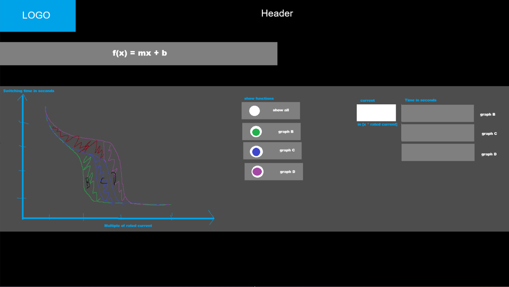
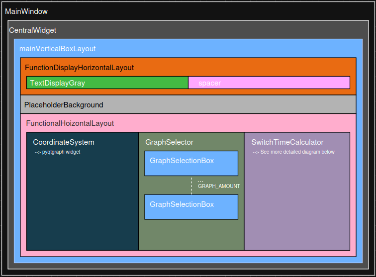
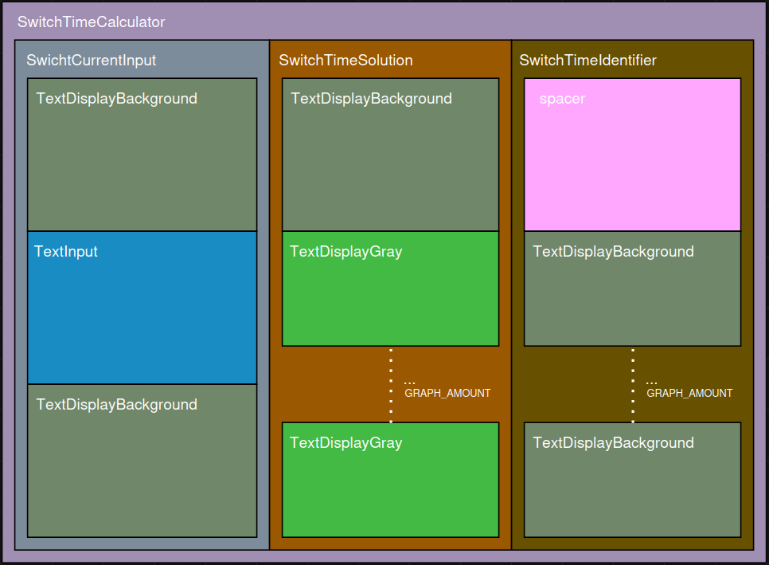
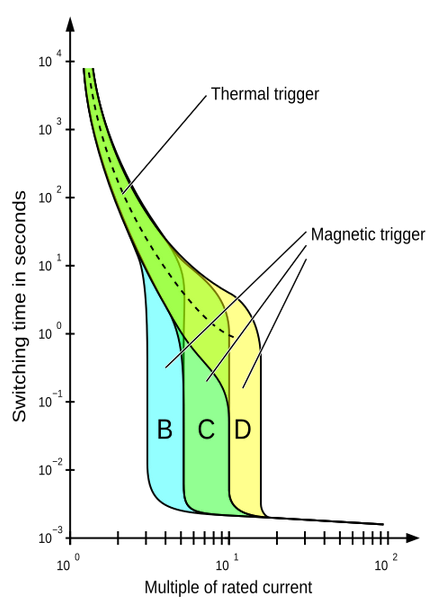

# MCB-characteristic-curves-UI
Interactive mapping of the characteristic curves of a miniature circuit breaker (MCB). Programmed in Python, this repository provides a user interface that allows the selection of different characteristic curves and the calculation of the MCB's tripping point depending on the rated current.

# Project progress
I've designed a first visual UI prototype shown in the picture below. I tried to keep the UI simple and intuitive using colors to guide the user to visual only or action elements. A dark design with blue accents is used as the color scheme, as this conveys a professional and elegant impression.

## UI hierarchy structure
The following diagrams documents the different UI-elements and how they are nested within each other. The raw diagram file is save in `documentation/UI-Layout-Architecture.drawio` and can be edited using the web tools hosted on [draw.io](https://draw.io).

# Explanation of MCB characteristics curves
The characteristics curve shows how fast a MCB reacts to different amperage (example depicted below). The X-Axis is specified in multiples of the rated current printed on the circuit breaker. The Y-Axis shows the time the MCB need to react in seconds on a **logarithmic scale**. 

The curve can be split up into two areas. The curved area on the top left is the thermal trigger zone. In this zone the MCB reacts to smaller, long lasting overloads. The vertical area on the bottom constitutes the magnetic trigger zone. This zone reacts to high currents for example caused by a short circuit. MCB triggers almost instantaneously.

The characteristic curves do not represent specific functions, but rather ranges within which the circuit breaker can trip. For our purposes, the right-hand boundary of this range is most important, as it indicates the maximum tripping time of the circuit breaker. This ensures that we base our considerations on the worst-case scenario and the MCB switched with a 100% certainty.

(source: [onesto-ep.com](https://www.onesto-ep.com/de/blog/explaining-the-tripping-curves-of-type-a-b-c-and-d-mcb/))

(source: [wikipedia.org](https://en.wikipedia.org/wiki/File:Standard_Trip_Characteristic_of_a_Thermomagnetic_Circuit_Breaker.svg))

# Approximation of the characteristic curve
Since neither precise function definitions nor detailed value tables of characteristic curves seem to exist online, it becomes somewhat more complicated to build the mathematical background of the project. First, we need to extract precise and usable data from the characteristic curve diagrams and then create the corresponding function ourselves using cubic interpolation, a method for designing functions when only a few ordered points are given. 

Before we begin, we need to define some boundary conditions:

- Only the rightmost graph of each MCB type is relevant for us.

- There is a part of the resulting equation which applies to all MCB-types up to a certain type-dependent point.

- At the discontinuous point of the graph, where it drops vertically downwards, only the lowest value is relevant for our function.

The characteristic curve of a specific type can therefore be divided into three parts:

1. A portion of the common thermal curve
2. The transition of the thermal curve to the vertical drop
3. The transition of the discontinuity to the approach of zero

These parts can be developed using cubic interpolation which we will discuss in the next section.

## Cubic interpolation 
In order to perform a cubic interpolation, some points of the function equation must first be determined. Below the following image of the tripping characteristic of a type B MCB is a table of values ​​that can be clearly extracted and on which the later calculation of the characteristics curve function is based.
